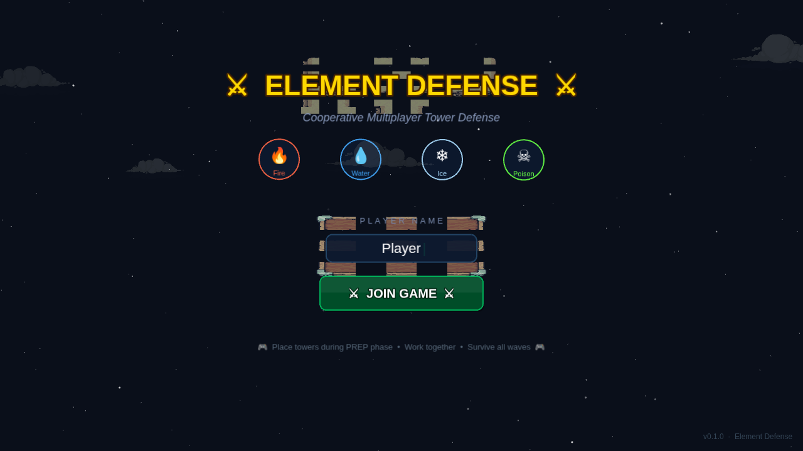
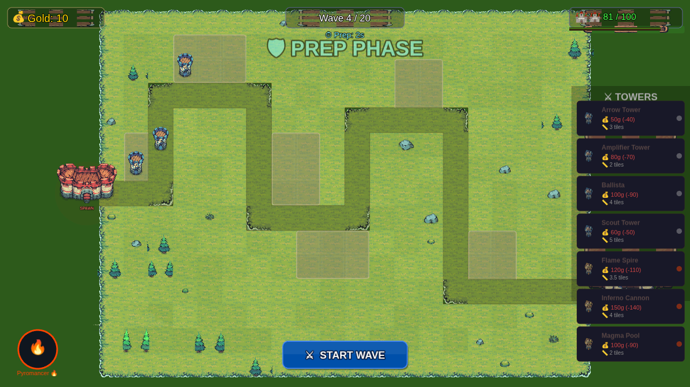
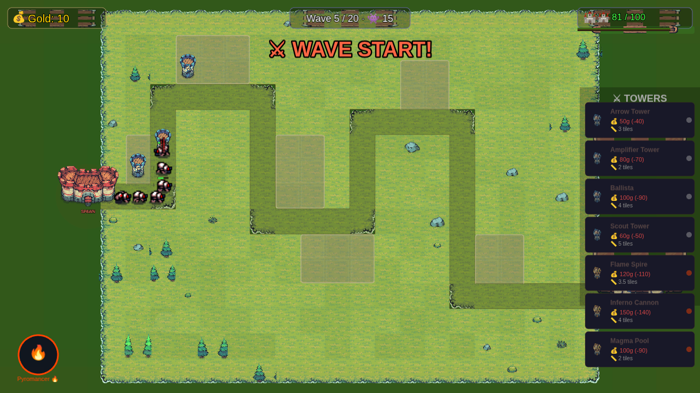

# ⚔ Element Defense

Cooperative multiplayer tower defense game built with Phaser 3 and Socket.IO. Choose an element class, place towers, and survive 20 waves of robot enemies with your friends.



## Features

- **4 Element Classes** — Fire, Water, Ice, Poison — each with unique towers and passives
- **20 Waves** — Grunts, runners, tanks, flyers, invisible enemies, and bosses
- **Cooperative Multiplayer** — Real-time via Socket.IO, shared economy and defense
- **Tiny Swords Art** — Medieval defenders (Warriors, Archers, Lancers, Monks) vs. sci-fi robot invaders
- **Full Test Suite** — 80+ unit/integration tests + Playwright E2E browser tests

### Screenshots

| Prep Phase | Combat |
|:---:|:---:|
|  |  |

## Stack

- **Client:** Phaser 3 + Vite + TypeScript
- **Server:** Express + Socket.IO + TypeScript
- **Shared:** Common types, configs, and map data
- **Monorepo:** pnpm workspaces + Turborepo
- **Testing:** Vitest (unit/integration) + Playwright (E2E browser)
- **Art:** [Tiny Swords](https://pixelfrog-assets.itch.io/tiny-swords) (Free Pack) + custom robot/military sprites

## Prerequisites

- Node.js 22+
- pnpm 10+

## Setup

```bash
pnpm install
```

## Development

```bash
# Start both client (port 3000) and server (port 3001)
pnpm dev

# Or start them individually
pnpm --filter @td/client dev    # Vite dev server on :3000
pnpm --filter @td/server dev    # Express + Socket.IO on :3001
```

## How to Test

### Unit & Integration Tests (Vitest)

All packages have unit tests. The server also has Socket.IO integration tests.

```bash
# Run everything (unit + integration across all packages)
pnpm test

# Run tests for a specific package
pnpm --filter @td/server test
pnpm --filter @td/client test
pnpm --filter @td/shared test

# Watch mode (re-runs on file changes)
pnpm --filter @td/server test:watch
```

**What's covered:**

| Package | Tests | What they test |
|---------|-------|----------------|
| `shared` | Data validation, type exports | Map configs, tower/enemy data integrity |
| `client` | State interpolation | Client-side snapshot interpolation logic |
| `server` | Unit tests | GameSimulation, EconomySystem, CombatSystem, TowerSystem, WaveScheduler, EnemySystem, ReactionSystem, GameRoom, GameLoop |
| `server` | Integration tests | Full Socket.IO multiplayer flows — connection, join/disconnect, class select, ready up, tower placement/rejection/selling, wave start, enemy spawning, chat broadcast |

### E2E Browser Tests (Playwright)

These tests launch real browsers and play the actual game. Playwright automates Chromium to navigate menus, place towers, fight waves, and verify game state through the client's exposed `window.__gameClient` API.

**First-time setup** (downloads Chromium):

```bash
npx playwright install chromium
```

**Run E2E tests:**

```bash
# Headless (CI-friendly, fastest)
pnpm test:e2e

# Headed (watch the browser do its thing)
pnpm test:e2e:headed

# Interactive UI mode (pick and debug individual tests)
pnpm test:e2e:ui
```

> Playwright auto-starts both the Vite dev server (:3000) and the Express server (:3001) — no need to run `pnpm dev` first.

**E2E test suites:**

| Suite | What it does |
|-------|-------------|
| `e2e/lobby.spec.ts` | Boot sequence, scene transitions, canvas dimensions, join flow, screenshot baselines |
| `e2e/game-flow.spec.ts` | Scene navigation from lobby → class select → game |
| `e2e/gameplay.spec.ts` | **Real gameplay** — places 19 towers across 6 build zones (5 tower types), fights 2 waves, verifies enemy spawning/damage/death, tower selling with gold refund, base HP tracking, wave completion bonuses |

**Screenshots** are saved to `e2e/screenshots/` on each run for visual inspection.

### Running Everything

```bash
# Full test suite: unit + integration + E2E
pnpm test && pnpm test:e2e
```

### Test Architecture Notes

- **Unit tests** use Vitest and run in Node — no browser needed
- **Integration tests** spin up a real Express + Socket.IO server per test on a random port, connect actual `socket.io-client` instances, and verify the full multiplayer protocol
- **E2E tests** use Playwright to drive Chromium against the real client + server. Game state is read via `page.evaluate()` calls to `window.__gameClient.getLatestState()`. Tower placement uses the client's API rather than canvas coordinate clicks for reliability
- **State isolation**: Integration tests create a fresh server per test. E2E tests emit a `reset_game` socket event before each test to get a clean `GameSimulation`

## Game Economy

| Mechanic | Value |
|----------|-------|
| Starting gold | 200 per player |
| Wave bonus | 40 + 10 × wave# per player |
| Kill bounty | 5–100g (scales with enemy type) |
| Tower sell refund | 70% of cost |
| Arrow Tower (cheapest) | 50g |

## Project Structure

```
tower-defense/
├── packages/
│   ├── client/          # Phaser 3 game client (Vite)
│   │   └── src/
│   │       ├── assets/  # Asset manifest & typed helpers
│   │       ├── scenes/  # BootScene, LobbyScene, ClassSelectScene, GameScene, HudScene
│   │       ├── ui/      # TowerPanel component
│   │       └── audio/   # AudioManager
│   ├── server/          # Express + Socket.IO game server
│   │   └── src/
│   │       ├── game/    # GameSimulation, GameLoop
│   │       ├── systems/ # Combat, Economy, Tower, Wave, Enemy systems
│   │       └── integration/  # Socket.IO integration tests
│   └── shared/          # Types, configs, map data
├── e2e/                 # Playwright E2E browser tests
├── docs/screenshots/    # Game screenshots
├── playwright.config.ts
├── turbo.json
└── package.json
```

## Art Direction

- **Defenders:** Tiny Swords medieval units — Warriors (fire), Archers (water), Lancers (ice), Monks (poison)
- **Buildings:** Tiny Swords faction towers as tower bases, castles for spawn/base markers
- **Terrain:** Tiny Swords tilesets with autotiled grass and dirt paths
- **Enemies:** Robot sprites (Scarab, Spider, Hornet, Centipede, Wasp) — medieval vs. sci-fi contrast
- **UI:** Hand-drawn graphics buttons, Tiny Swords wood table panels, decorative elements
